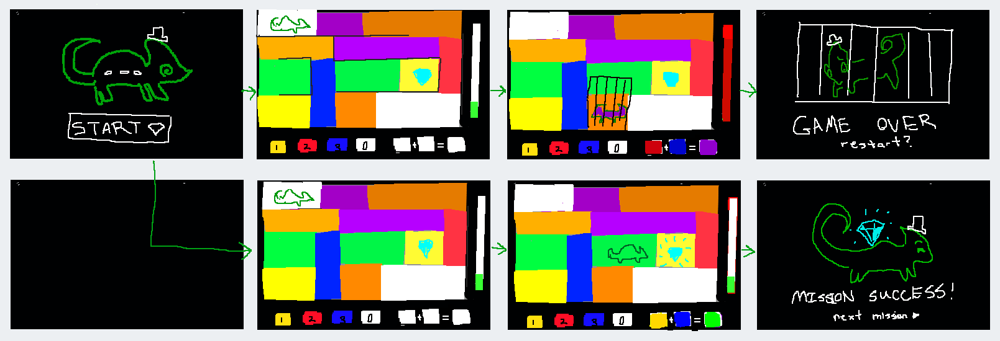

# Game Name

## Elevator Pitch

*Top-down color mixing stealth game where you play as a chameleon and you must match the color of the background to not get caught on your mission. A one sentence pitch for your game. Pretend that your were pitching your game to a executive going to the elevator. You have less than 60 Seconds. Check [this resource](http://www.gameacademy.com/perfecting-indie-games-elevator-pitch/) for more information.*

## Influences (Brief)

- *Influence #1*:
  - Medium: *Real life*
  - Explanation: *Chameleons blend into their backgrounds to hide and matching the background matches well with color mixing.*
- *Influence #2*:
  - Medium: *Maze games and adventure games*
  - Explanation: *Influenced by having a character navigate a world and have to do certain things to unlock / avoiding certain areas to get to a goal.*
- *Influence #3*:
  - Medium: *(Television, Games, Literature, Movies, etc.)*
  - Explanation: *In one paragraph or less, explain why this is an influence.*

## Core Gameplay Mechanics (Brief)

*Give a very high-level description of any core gameplay mechanics*

- *Use arrow keys (OR WASD) to move*
- *Drag colors to color mixing area to change chameleon colors*
- *If the player is a different color than the floor, then the suspicion meter rises*
- *The player loses if the suspicion meter reaches 100%* 

# Learning Aspects

## Learning Domains

*Briefly list any and all of the disciplines and learning domains for this subject.*
*Art, color theory*

## Target Audiences

*Who are your learners?*
*Mid-late elementary school kids*

## Target Contexts

*Describe what kinds of formal and informal learning contexts this will be used in (e.g., courses, k-12 computer labs during free time).*
*Computer labs during free time for kids of appropriate age*

## Learning Objectives

*Remember, Learning Objectives are NOT simply topics. They are statements of observable behavior that a learner can do after the learning experience. You cannot observe someone "understanding" or "knowing" something.*

- *Short Name*: *By the end of this lesson, students should be able to mix specified primary colors into secondary colors*
- *Short Name*: *By the end of this lesson, students should be able to identify primary and secondary colors*
- *Short Name*: *Formal Learning Objective #3*

## Prerequisite Knowledge

*What do they need to know prior to trying this game?*

- *Prior to the game, students should be able to identify and distinguish colors*
- *Prerequisite Learning Objective #2*

## Assessment Measures

*Describe how the learning will be assessed, e.g., pre/post multiple-choice test, or SAT, or some other instrument.*

*If proposing a new instrument, briefly and concisely list some example assessment questions.*

*We could use a pre and post free response quiz. Some example of possible questions are:
Is Red a primary color, What primary color makes up the color green?*

# What sets this project apart?

*Give some reasons why this game is not like every other game out there. Whether the learning objective is unique, the gameplay mechanics are new, or what. You should persuade the reader that your game is novel and worthy of development. Consider arguments that would be persuasive to a Venture Capitalist, Teacher, or Researcher. These might be focused on learning needs, too.*

- *The concept of using color matching for steatlh as a main game-play aspect is unique*
- *Color theory is an under-taught discipline*
- *Reason #3*
- *Reason #4*
- *etc.*

# Player Interaction Patterns and Modes

## Player Interaction Pattern

*Describe how people play your game, how many players are involved at once, how they interact with the system works, etc.*
*There is one player that plays at a time. They move around on a grid of paths, trying to match their color with the color of the path.*

## Player Modes

*Your game has one or more player modes. Describe each discrete mode, considering things like menus too. Generally describe the transitions between modes too.*

- *Single player: You advance your way through different levels, during each of which you try to navigate your way to the goal.*
- *Player mode #2*: *Description*
- *etc.*

# Gameplay Objectives

- *Primary Objective #1*:
    - Description: *Reach the goal while not being seen*
    - Alignment: *In order to not be seen, you need to match your color to the floor/background*
- *Primary Objective #2*:
    - Description: *Description*
    - Alignment: *Describe how this aligns with one or more learning objectives*
- *etc.*

# Procedures/Actions

*Describe the control scheme and what actions a user can take in the game.*
*Use the arrow keys to move around and drag colors to the palatte to change the chameleons colors*

# Rules

*What resources are available to the player that they make use of?  How does this affect gameplay? How are these resources finite?*
*If the player is a different color than the floor, then the suspicion meter increases*
*If the suspicion meter becomes full, then you fail that level*
*If the player is the same color as the floor, the suspicion meter goes down over time*
*Once the player reaches the goal of the current level, the player moves on to the next pre-set level*
*Over time, the levels become more complicated*
*Players can pick up colors from the ground to use to blend into the background in the current level, picking up colors allows you to create more color combinations to blend in with*

# Objects/Entities

*What other things are in the world that you need to design? These may or may not directly translate to actual objects and classes.*
*Would need to design tiles for the level*
*Would need a goalpoint/startpoint for each level*
*Would need to design walls so the player doesnt pass through them*
*Guiding text when the player encounters new things*
*Would need to design colors on the ground that you can pick up*
*Would need to design the color palette used to change the color of the chameleon*
*Would need to design the color inventory*
*Would need to design the suspicion bar*
*Would need to arrange the tiles and start/endpoints for each level*

## Core Gameplay Mechanics (Detailed)

- *Use arrow keys (OR WASD) to move*
- *Use number pad to mix colors*
- *Suspicion meter rises and falls depending on how visible the player is*
- *The player loses if the suspicion meter reaches 100%* 

- *Use arrow keys (OR WASD) to move*: *W/up-arrow moves the player up, A/left-arrow moves the player to the left, S/down-arrow moves the player down and D/righ-arrow moves the player to the right. The player can only move on floor tiles and can not move through walls. If a player attempts to move in a direction there is a wall blocking them, they will not move.*
- *Use number pad to mix colors*: *The player has colors in their color inventory. There are three total spots in the inventory corresponding to the three different primary colors. Each of these spots has an associated key, Press 1 to add the first color to the palatte, 2 for the second and 3 for the third. 0 clears the palette and ENTER submits the color change of the chameleon. *
- *Suspicion meter rises and falls depending on how visible the player is*: *While the player is standing on a tile that is a different color than they are, the suspicion meter will gradually increase. Alternatively, while the player is on a tile that is the same color, the suspicion meter will gradually decrease.*
- *The player loses if the suspicion meter reaches 100%*: *If the suspicion meter reaches 100%, then the player is spotted and shown a screen that they are caught and are forced to restart the level*

    
## Feedback

*Explicitly describe what visual/audio/animation indicators there are that give players feedback on their progress towards their gameplay objectives (and ideally the learning objectives).*
*Describe what longer-term feedback you detect and give that guides the player in their learning and lets them know how they are doing in regards to the learning objectives.*

*The suspicion meter changes colors as your suspicion increases. Suspicion is green when low, yellow when medium, and red when high*
*The music gets more dramatic when youre suspicion increases, and is more calm when your suspicion is low*
*You are shown some animtion when you complete a level, showing the character moving onto the next level*
*When your suspicion meter reaches 100%, a trap falls on you and you can't move, followed by another animation*
*Animation plays when you finish the final level*

# Story and Gameplay

## Presentation of Rules

*Briefly describe how the player will learn the gameplay mechanics. Avoid using walls of text, since people will not read them. Think instead of natural ways of teaching mechanics iteratively and slowly.*

*The player will run through a tutorial level that will visual cue to guide the player to learn the mechanics. When new mechanics pop up, small boxes of text will guide their use*

## Presentation of Content

*Briefly describe how the player will be taught the core material they are meant to learn. Avoid using walls of text, since people will not read them. Think instead of natural ways of teaching material iteratively and slowly.*

*The player will learn the core material by experimenting with mixing colors and creating various color combinations while playing the game*

## Story (Brief)

*The Summary or TL;DR version of below*

*You are a phantom thief chameleon going on a series of heists, but need to sneak past the guards/security in each case to grab your target*

## Storyboarding

*Go into as much detail as needs be to visually convey the Dynamics of your game. Be detailed. Create storyboards and freeze frame images that concisely capture important key elements of your game. You are strongly recommended to sketch pictures on paper and embed them here. Be sure make it clear how previously-described mechanics come through in the dynamics.*

# Assets Needed

## Aethestics

*Give a sense of the aesthetics of your game, the spirit and atmosphere. Use descriptive, evocative words that can help the reader understand the emotional response of your game.*

## Graphical

- Characters List
  - *Chameleon main character*
  - *...*
- Textures:
  - *Texture 1*
  - *Texture 2*
  - *...*
- Environment Art/Textures:
  - *Environment Texture 1*
  - *Environment Texture 2*
  - *...*

## Audio

*Game region/phase/time are ways of designating a particularly important place in the game.*

- Music List (Ambient sound)
  - *Game region/phase/time*: *Example 1*, *Example 2*
  - *Game region/phase/time*: *Example 3*, *Example 4*
  
*Game Interactions are things that trigger SFX, like character movement, hitting a spiky enemy, collecting a coin.*

- Sound List (SFX)
  - *Game Interaction*: *Example 1*, *Example 2*
  - *Game Interaction*: *Example 3*, *Example 4*

# Metadata

* Template created by Austin Cory Bart <acbart@udel.edu>, Mark Sheriff, Alec Markarian, and Benjamin Stanley.
* Version 0.0.3
